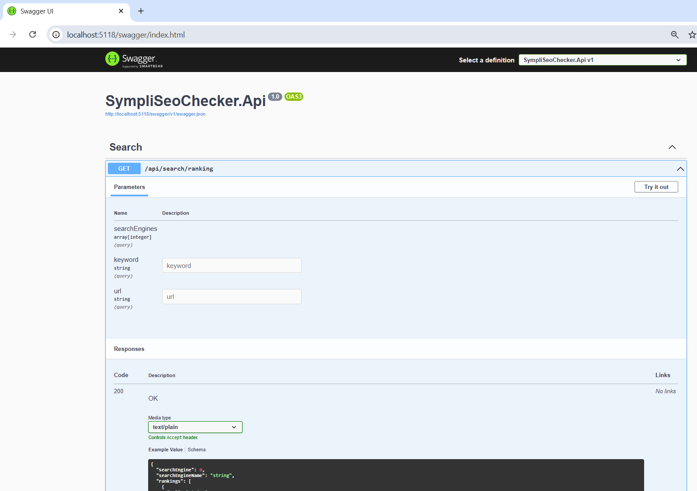
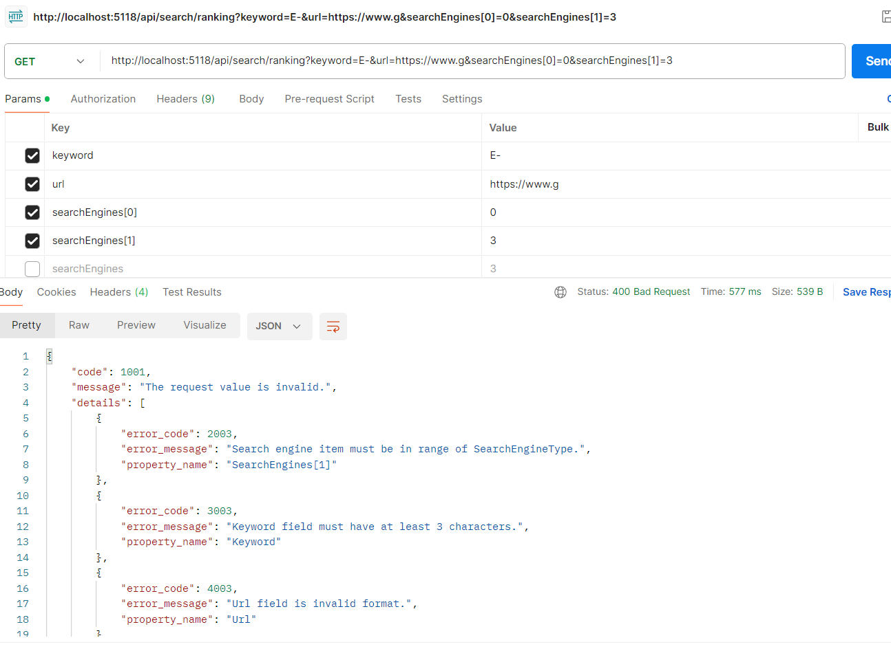
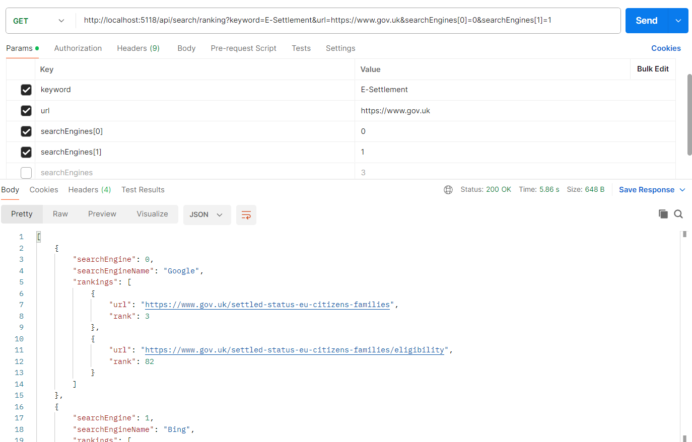
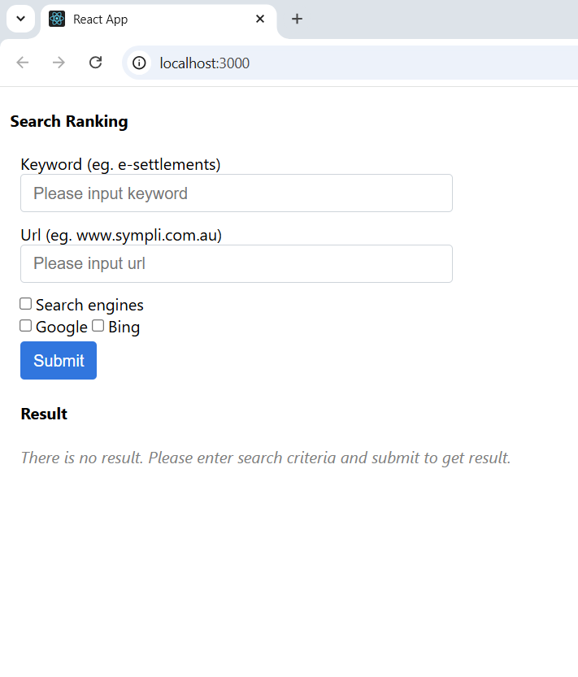
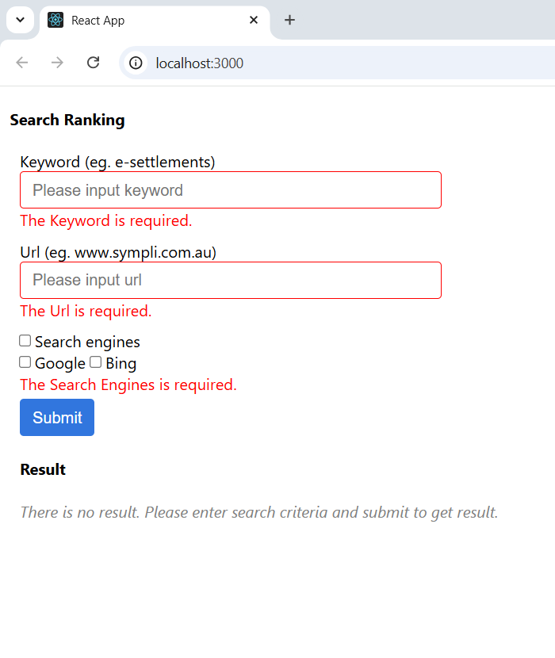
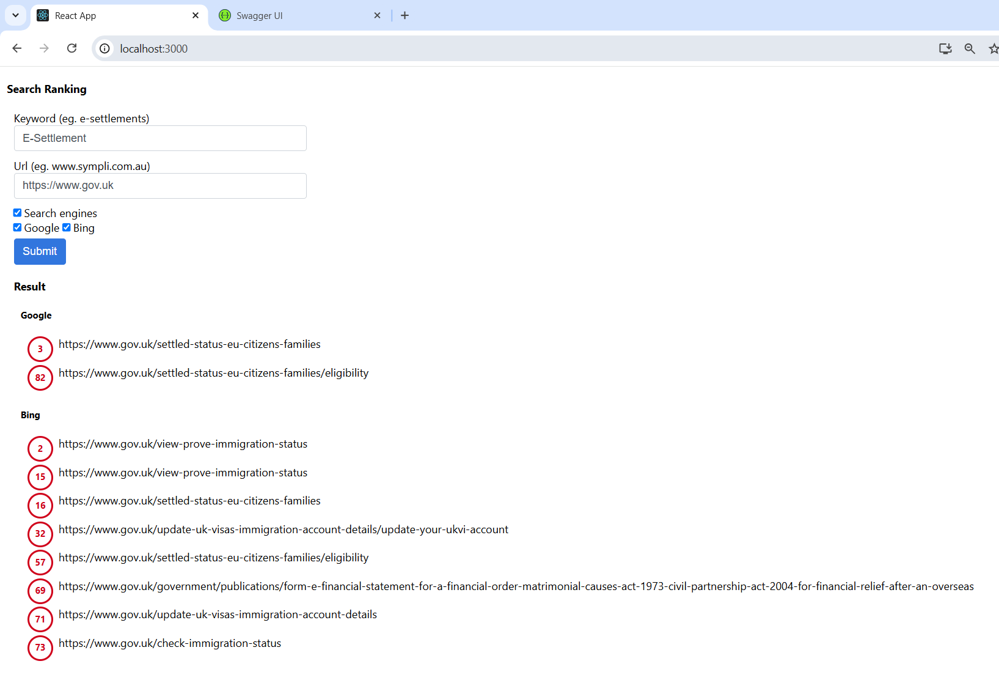

# Sympli Seo Checker Solution

 > <cite>Prepared by Tuong Nguyen</cite>

## 1. Setup Source code

### a. Setup Back end
Update the application Url to run in `launchSettings.json` file. The url is `localhost:5118` in the current default setup.

### b. Setup Front end
Update API host in `src\environment.ts` file. Current setup it is `http://localhost:5118`.

## 2. Run the back end
- Swagger page

- Postman called with invalid parameters and validation errors occurred

- Postman called with valid parameters and search ranking has been responsed

## 3. Run the front end
- Initial page

- Enter invalid values, the validation errors occurred

- Submit the valid values, the search ranking will be responsed.

## 4. To do list
- Back end
  - Add new controller to get all available search engines types
- Front end
  - Fetch all search engine types and load `Search Engines` automatically (Not fixed hard code).
- Unit test, it should be added more unit test on
  - Validation in `FluentValidator`
  - Google and Bing `pattern` to get `href`
  - Should add unit test on `Service.Helpers` with the function `GetMatchedUrlRankings` and `GetHrefsFromHtmlContent`
  - `CommonUtility` function such as `IsValidUrl`, `IsValidEnum`, `GetErrorMessage`, `CalcPagesCount`